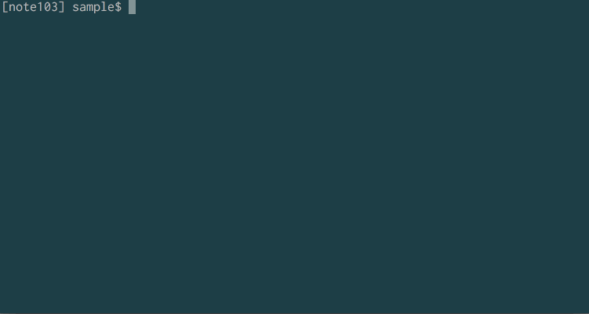

# NAME

delete.sh - Delete a file or a directory through the pull-down menu.

# DESCRIPTION

プルダウン方式でカレントディレクトリ内のファイルやディレクトリを削除します。

# DEMO



# Installation

1) Download a repogitory or the script `delete.sh`.

2) Run a script.

```bash
$ sh /path/to/delete.sh
```

## option

- `a` オプションを付けると対象に不可視ファイルを含めます。
- `p` オプションを付けると選択ツールを`cho`から`peco`へ変更します。

## alias (example)

```bash
alias d="sh /path/to/delete.sh"
alias d.="sh /path/to/delete.sh a"
alias dp="sh /path/to/delete.sh p"
alias dp.="sh /path/to/delete.sh ap"
```

# REQUIREMENT

- [cho](https://github.com/mattn/cho)
- [peco](https://github.com/peco/peco)

# LICENSE

Copyright (C) Hiroaki Kadomatsu.  
This library is free software; you can redistribute it and/or modify it under the same terms as Perl itself.

# AUTHOR

Hiroaki Kadomatsu (@note103)

- [Blog](http://note103.hateblo.jp/)
- [Twitter](https://twitter.com/note103)

